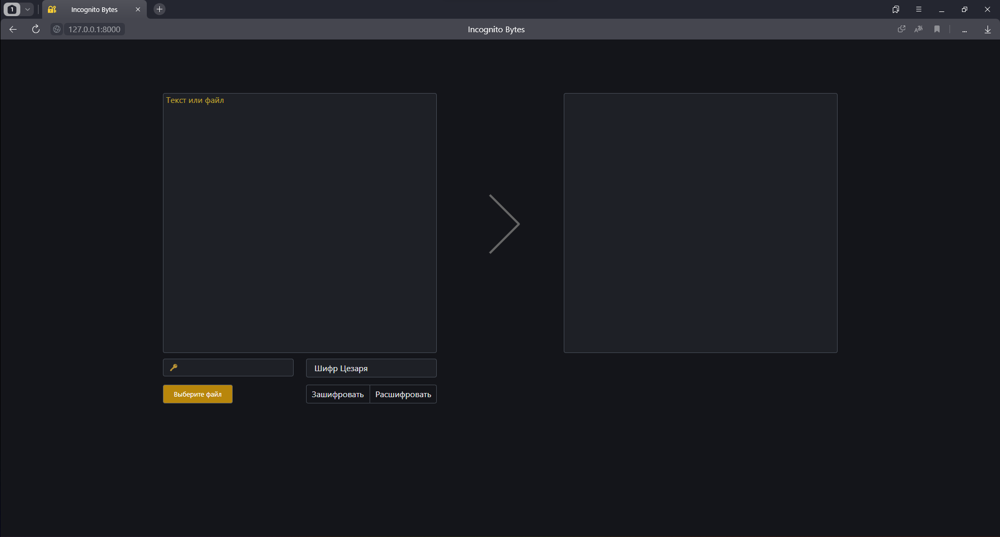

# INCOGNITO BYTES

Веб-приложение для шифрования и расшифрования текста и файлов. Разработанное на основе Django, приложение обеспечивает функциональность шифрования и расшифрования текстовых данных и любых файлов.

## Основные характеристики:

### Алгоритмы шифрования:
В проекте были самостоятельно реализованы 7 алгоритмов шифрования для обработки файлов и текстовых данных разного формата, среди которых пользователь может выбрать наиболее подходящий под его задачу.

### Адаптивный дизайн:
Интерфейс проекта адаптирован под различные устройства и разрешения экранов. Анимации добавлены для улучшения пользовательского взаимодействия, а также проведена оптимизация пространства путем скрытия ненужных элементов.

### Обработка ошибок:
Система обработки ошибок сообщает пользователю о невалидности или несоответствии введенных данных выбранному алгоритму шифрования.

### Подгрузка данных через AJAX:
Проект использует асинхронную загрузку данных с помощью AJAX для улучшения производительности и удобства использования.

### Кастомизация форм:
Элементы форм настраиваются и стилизуются с использованием JavaScript для улучшения пользовательского опыта.

"Incognito Bytes" служит примером возможности решения актуальных задач в области обработки и защиты данных.

## Описание и скриншоты:

### Собственно страница приложения:
Так она выглядит до отправки формы при пустых полях:

Так после:

### Последовательность работы на примере RSA:
Выбираем RSA из набора алгоритмов:

Генерируем RSA ключи в формате PEM, генерация использует AJAX, соответственно страница не перезагружается. Добавляем файл, ставим action на шифрование, заполняем публичный ключ, прячем приватный ключ. Отправляем форму. После мы можем скачать зашифрованный файл и очистить все поля.

Можно зашифровать и текст, тогда шифрованный файл доступный для скачивания будет в формате .txt

### Обработка ошибок и валидность формы:

 и так далее..
